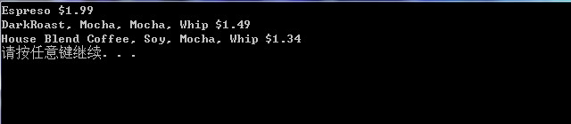

# 装饰者模式

## 1. 面向对象原则

- **封装变化：找到应用中可能变化之处，把它们独立出来，不要和那些不需要变化的代码混在一起。**
把会变化的部分取出并封装起来，以便以后可以轻易地改动或扩充此部分，而不影响不需要变化的其他部分。
- **针对接口（Interface）编程，而不是针对实现（implenments）编程。**
- **多用组合，少用继承。**

如同书上所说，鸭子的行为不是(IS-A)继承extends而来的，而是通过各种（HAS-A）接口类FlyBehavior和QuackBehavior组合而来的。
这样做的好处有：

> - 使用组合具有更大的弹性，可以将算法簇封装成类
> - 只要组合的对象符合正确的接口标准，就可以在运行时动态地改变行为
- **为交互对象之间的松耦合设计而努力。这样的好处有：**
> - **当两个对象之间松耦合，他们依然可以（通过接口）交互，但是不太清楚彼此实现的细节。**
> - **当新类型的观察者出现时，主题的代码不需要修改。所要做的就是在新类型里实现此观察者的接口，然后注册为观察者即可（使用一个Subject的指针指向实现的具体的主题）。**
> - **改变主题或观察者其中一方，并不会影响另一方。**

- **`对扩展开放，对修改关闭。`**
> - **装饰者和被装饰者都必须是一样的类型，拥有共同的超类。**
> - **当我们的装饰者与组件（被装饰者）结合时，就是在加入新的行为。而加入的新的行为是通过组合（可以使用具体的组合类，也可以使用智能指针）实现的。**

---

## 2. 装饰者模式

- **动态地将责任附加到对象上。若要扩展功能，装饰者提供了比继承更具有弹性的替代方案。**

---

## 3. 设计模式之装饰者模式的C++实现

### 3.1创建装饰者与被装饰者的共同接口类Beverage、调料的接口类CondimentDecorator

**(抽象基类)接口类Beverage.h代码：**

```C++
#pragma once
#ifndef BEVERAGE_H
#define BEVERAGE_H

#include<string>
//建立一个饮料的抽象基类
class Beverage {
public:
	Beverage();
	virtual ~Beverage();//为抽象基类的析构函数声明为virtual
	virtual double cost() const = 0;
	virtual std::string getDescription() const = 0;//这里声明为虚函数，让每个子类重写该函数
protected:
	std::string description;
};
#endif // !BEVERAGE_H

```

> - **这里与书上的Java代码有点不同。我们把`getDescription()方法也声明为纯虚函数，让每个子类重写该函数`。而且description使用默认值，不是书上的"Unknown Beverage"，是因为我们要`在main()函数中调用getDescription()方法来实现把饮料和调料的描述都打印出来`。**

**接口类Beverage.cpp代码：**

```C++

#include "Beverage.h"

Beverage::Beverage() {
}

Beverage::~Beverage() {
}

```

**调料接口类CondimentDecorator.h代码：**

```C++
#pragma once
#ifndef CONDIMENTDECORATOR_H
#define CONDIMENTDECORATOR_H
#include "Beverage.h"
//调料的抽象基类
class CondimentDecorator :
	public Beverage {
public:
	CondimentDecorator();
	virtual ~CondimentDecorator();
	//使所有的调料装饰着都必须重新实现getDescription()方法
	virtual std::string getDescription() const = 0;
};


#endif // !CONDIMENTDECORATOR_H

```

**接口类CondimentDecorator.cpp代码：**

```C++
#include "CondimentDecorator.h"

CondimentDecorator::CondimentDecorator() {
}

CondimentDecorator::~CondimentDecorator() {
}
```

### 3.2创建被装饰者接口类Beverage的具体实现类DarkRoast、Decab、Espreso、HouseBlend

**具体实现类DarkRoast.h代码：**

```C++
#pragma once
#ifndef DARKROAST_H
#define DARKROAST_H
#include "Beverage.h"
class DarkRoast :
	public Beverage {
public:
	DarkRoast();
	~DarkRoast();
	double cost() const override;
	std::string getDescription() const override;
};
#endif // !DARKROAST_H

```

**具体实现类DarkRoast.cpp代码：**

```C++
#include "DarkRoast.h"

DarkRoast::DarkRoast() {
	description = "DarkRoast";
}

DarkRoast::~DarkRoast() {
}

double DarkRoast::cost() const {
	return .99;//一杯深焙要0.99美元
}

std::string DarkRoast::getDescription() const {
	return description;
}

```

**具体实现类Decab.h代码：**

```C++
#pragma once
#ifndef DECAB_H
#define DECAB_H
#include "Beverage.h"

class Decab :
	public Beverage {
public:
	Decab();
	~Decab();
	double cost() const override;
	std::string getDescription() const override;
};

#endif // !DECAB_H

```

**具体实现类Decab.cpp代码：**

```C++
#include "Decab.h"

Decab::Decab() {
	description = "Decab";
}

Decab::~Decab() {
}
double Decab::cost() const {
	return 1.05;
}
std::string Decab::getDescription() const {
	return description;
}

```

**具体实现类Espreso.h代码：**

```C++
#pragma once
#ifndef ESPRESO_H
#define ESPRESO_H

#include "Beverage.h"
//实现一个具体的Beverage抽象类
class Espreso :
	public Beverage {
public:
	Espreso();
	~Espreso();
	double cost() const override;//override明确声明要覆盖基类的virtual函数
	std::string getDescription() const override;
};

#endif // !ESPRESO_H

```

**具体实现类Espreso.cpp代码：**

```C++
#include "Espreso.h"
Espreso::Espreso() {
	description = "Espreso";
}

Espreso::~Espreso() {
}

double Espreso::cost() const {
	return 1.99;//一杯Espreso要1.99元
}

std::string Espreso::getDescription() const {
	return description;
}
```

**具体实现类HouseBlend.h代码：**

```C++
#pragma once
#ifndef HOUSEBLEND_H
#define HOUSEBLEND_H
#include "Beverage.h"
//实现具体的Beverage抽象类
class HouseBlend :
	public Beverage {
public:
	HouseBlend();
	~HouseBlend();
	double cost() const override;//override明确声明要覆盖基类的virtual函数
	std::string getDescription() const override;
};

#endif // !HOUSEBLEND_H

```

**具体实现类HouseBlend.cpp代码：**

```C++
#include "HouseBlend.h"

HouseBlend::HouseBlend() {
	description = "House Blend Coffee";
}

HouseBlend::~HouseBlend() {
}

double HouseBlend::cost() const {
	return .89;//一杯HouseBlend要0.89元
}
std::string HouseBlend::getDescription() const {
	return description;
}
```

### 3.3创建CondimentDecorator接口类的具体实现类Milk、Mocha、Soy、Whip

**实现类Milk.h代码：**

```C++
#pragma once
#ifndef MILK_H
#define MILK_H
#include "CondimentDecorator.h"
#include<memory>
class Milk :
	public CondimentDecorator {
public:
	Milk();
	Milk(std::shared_ptr<Beverage> pB) : pBeverage(pB) {}
	~Milk();
	double cost() const override;
	std::string getDescription() const override;
private:
	std::shared_ptr<Beverage> pBeverage;//使用智能指针，指向抽象基类Beverage
};

#endif // !MILK_H

```

> - **我们这里使用`智能指针std::shared_ptr<Beverage> pBeverage`来实现组合。当然，也可以使用`普通指针Beverage* pBeverage`来实现。**

**实现类Milk.cpp代码：**

```C++
#include "Milk.h"

Milk::Milk() {
}


Milk::~Milk() {
}

double Milk::cost() const {
	return .10 + pBeverage->cost();
}

std::string Milk::getDescription() const {
	return pBeverage->getDescription() + ", Milk";
}

```

**实现类Mocha.h代码：**

```C++
#pragma once
#ifndef MOCHA_H
#define MOCHA_H
#include<memory>
#include "CondimentDecorator.h"
//实现调料装饰者抽象类CondimentDecorator
class Mocha :
	public CondimentDecorator {
public:
	Mocha();
	//自定义的构造函数
	Mocha(std::shared_ptr<Beverage> pB) : pBeverage(pB) {}
	~Mocha();
	double cost() const override;
	std::string getDescription() const override;
private:
	std::shared_ptr<Beverage> pBeverage;//使用智能指针，指向抽象基类Beverage
};
#endif // !MOCHA_H

```

**实现类Mocha.cpp代码：**

```C++
#include "Mocha.h"
Mocha::Mocha() {
	
}

Mocha::~Mocha() {
}

double Mocha::cost() const {
	//要计算带有Mocha饮料的价钱，首先需要委托给被装饰者对象pBeverage，以计算价钱
	//然后加上Mocha调料的钱，得到最后结果
	return .20 + pBeverage->cost();
}

std::string Mocha::getDescription() const {
	//希望能不仅仅描述调料Mocha，还能描述在什么饮料上加调料
	
	return (pBeverage->getDescription() + ", Mocha");
}

```

**实现类Soy.h代码：**

```C++
#pragma once
#ifndef SOY_H
#define SOY_H
#include<memory>

#include "CondimentDecorator.h"
class Soy :
	public CondimentDecorator {
public:
	Soy();
	Soy(std::shared_ptr<Beverage> pB) : pBeverage(pB) {}
	~Soy();
	double cost() const override;
	std::string getDescription() const override;
private:
	std::shared_ptr<Beverage> pBeverage;
};

#endif // !SOY_H

```


**实现类Soy.cpp代码：**

```C++
#include "Soy.h"
Soy::Soy() {
	
}

Soy::~Soy() {
}

double Soy::cost() const {
	//豆浆0.15美元
	////要计算带有Soy饮料的价钱，首先需要委托给被装饰者对象pBeverage，以计算价钱
	//然后加上Soy调料的钱，得到最后结果
	return .15 + pBeverage->cost();
}

std::string Soy::getDescription() const {
	//希望能不仅仅描述调料Soy，还能描述在什么饮料上加调料
	
	return (pBeverage->getDescription() + ", Soy");
}

```

**实现类Whip.h代码：**

```C++
#pragma once
#ifndef WHIP_H
#define WHIP_H
#include<memory>
#include "CondimentDecorator.h"
class Beverage;
class Whip :
	public CondimentDecorator {
public:
	Whip();
	Whip(std::shared_ptr<Beverage> pB) : pBeverage(pB) {}
	~Whip();
	double cost() const override;
	std::string getDescription() const override;
private:
	std::shared_ptr<Beverage> pBeverage;
};
#endif // !WHIP_H

```

**实现类Whip.cpp代码：**

```C++
#include "Whip.h"
Whip::Whip() {
	
}

Whip::~Whip() {
}

double Whip::cost() const {
	//奶泡0.10美元
	////要计算带有Whip饮料的价钱，首先需要委托给被装饰者对象pBeverage，以计算价钱
	//然后加上Whip调料的钱，得到最后结果

	return .10 + pBeverage->cost();
}

std::string Whip::getDescription() const {
	//希望能不仅仅描述调料Whip，还能描述在什么饮料上加调料
	
	return (pBeverage->getDescription() + ", Whip");
}

```

---

## 4创建main.cpp进行验证

**main.cpp代码：**
```C++
//装饰者和被装饰者都具有相同的Beverage类型
#include "Beverage.h"
//具体实现的被装饰者
#include "Espreso.h"
#include "HouseBlend.h"
#include "DarkRoast.h"
#include "Decab.h"
//具体实现的装饰者
#include "CondimentDecorator.h"
#include "Mocha.h"
#include "Soy.h"
#include "Whip.h"
#include "Milk.h"

#include<iostream>
using namespace std;
int main() {
	//先来一杯Espreso,显示其价格
	std::shared_ptr<Beverage> beverage(new Espreso());
	cout << beverage->getDescription() << " $" << beverage->cost() << endl;

	//来一杯DarkRoast，加上两份Mocha,一份Whip
	std::shared_ptr<Beverage> beverage2(new DarkRoast());
	//由于智能指针必须使用直接初始化，并且智能指针的赋值运算符=左右两边都必须是相同类型，
	//所有beverage2 = new Mocha(beverage2);是不行的
	//因为右边返回的类型为Mocha*，而不是std::shared_ptr<Beverage>
	beverage2 = std::shared_ptr<Beverage>(new Mocha(beverage2));
	beverage2  = std::shared_ptr<Beverage>(new Mocha(beverage2));
	beverage2 = std::shared_ptr<Beverage>(new Whip(beverage2));
	cout << beverage2->getDescription() << " $" << beverage2->cost() << endl;

	std::shared_ptr<Beverage> beverage3(new HouseBlend());
	beverage3 = std::shared_ptr<Beverage>(new Soy(beverage3));
	beverage3 = std::shared_ptr<Beverage>(new Mocha(beverage3));
	beverage3 = std::shared_ptr<Beverage>(new Whip(beverage3));
	cout << beverage3->getDescription() << " $" << beverage3->cost() << endl;

	//所有调料的成员类型为普通指针Beverage*时，用法如下：
	/*
	Beverage *beverage3 = new HouseBlend();
	beverage3 = new Soy(beverage3);
	beverage3 = new Mocha(beverage3);
	beverage3 = new Whip(beverage3);
	cout << beverage3->getDescription() << " $" << beverage3->cost() << endl;
	*/
	system("pause");
	return 0;
}
```

**运行结果截图：**



---

## 5总结
- 装饰者模式的不足之处：**

> - 可以看出，使用装饰者模式会增加很多小类（包括组件类和装饰者类），如果过度使用，会导致程序变得复杂。
> - 在采用装饰者实例化具体组件时，因为要委托组件的方法，将增加代码复杂度。一旦使用装饰者模式，不只需要实例化组件，还要把组件包装进装饰者中。

- 装饰者模式的好处：**
> - 使用装饰者模式，我们将使用组合和委托的方式在运行时动态地加上新的行为。
> - 装饰者模式可以将一群装饰者来包装具体的组件，具有弹性。

---
