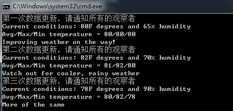

# 观察则模式

## 1. 面向对象原则

- **封装变化：找到应用中可能变化之处，把它们独立出来，不要和那些不需要变化的代码混在一起。**
把会变化的部分取出并封装起来，以便以后可以轻易地改动或扩充此部分，而不影响不需要变化的其他部分。
- **针对接口（Interface）编程，而不是针对实现（implenments）编程。**
- **多用组合，少用继承。**

如同书上所说，鸭子的行为不是(IS-A)继承extends而来的，而是通过各种（HAS-A）接口类FlyBehavior和QuackBehavior组合而来的。
这样做的好处有：

> - 使用组合具有更大的弹性，可以将算法簇封装成类
> - 只要组合的对象符合正确的接口标准，就可以在运行时动态地改变行为
- **`为交互对象之间的松耦合设计而努力。`这样的好处有：**
> - **当两个对象之间松耦合，他们依然可以（通过接口）交互，但是不太清楚彼此实现的细节。**
> - **当新类型的观察者出现时，主题的代码不需要修改。所要做的就是在新类型里实现此观察者的接口，然后注册为观察者即可（使用一个Subject的指针指向实现的具体的主题）。**
> - **改变主题或观察者其中一方，并不会影响另一方。**

---

## 2. 观察者模式

- **定义了对象之间的一对多依赖，这样一来，当一个对象改变状态时，它的所有依赖者都会收到通知并自动更新。**

---

## 3. 设计模式之观察者模式的C++实现

### 3.1创建Subject接口类、Observer接口类、DisplayElement接口类

- **我们使用`多重继承`的方式来继承观察者接口类和用于显示的接口类。**

**(抽象基类)接口类Subject.h代码：**

```C++
#pragma once
#ifndef SUBJECT_H
#define SUBJECT_H

#include <memory>
class Observer;//前置声明
//定义一个主题Subject的抽象接口类
class Subject {
public:
	Subject();
	virtual ~Subject();
	virtual void registerObserver(Observer &rhs) = 0;
	virtual void removeObserver(Observer &rhs)= 0;
	virtual void notifyObserver() = 0;
};

#endif // !SUBJECT_H
```

> - **这里我们的接口函数的参数为`Observer &rhs`，而不是`const Observer &rhs`,这是因为其接受的实参不一定是Observer类，而是具体的实现类类型，如`CurrentConditionDisplay、StatisticDisplay、ForcastDisplay`。**

> - **同时复习一下：`const引用可以绑定到非const对象上，但是const对象一样要绑定到const引用上`。**

**接口类Subject.cpp代码：**

```

#include "Subject.h"

Subject::Subject() {
}

Subject::~Subject() {
}

```

**(抽象基类)接口类Observer.h代码：**

```C++
#pragma once
#ifndef OBSERVER_H
#define OBSERVER_H
//则是一个观察者Observer的抽象接口类
class Observer {
public:
	Observer();
	virtual ~Observer();
	virtual void update(float temp, float humidity, float pressure) = 0;
	//virtual void display() = 0;
};

#endif // !OBSERVER_H

```

**接口类Observer.cpp代码：**

```C++
#include "Observer.h"
Observer::Observer() {
}

Observer::~Observer() {
}

```

**(抽象基类)接口类Observer.h代码：**

```C++
#pragma once
#ifndef DISPLAYELEMENT_H
#define DISPLAYELEMENT_H
//这是一个用于显示的抽象接口类
class DisplayElement {
public:
	DisplayElement();
	~DisplayElement();
	virtual void display() = 0;
};


#endif // !DISPLAYELEMENT_H

```

**接口类Observer.cpp代码：**

```C++
#include "DisplayElement.h"
DisplayElement::DisplayElement() {
}
DisplayElement::~DisplayElement() {
}

```

### 3.2创建Subject接口类的具体实现类WeatherDate

- **由于主题接口类的具体实现类WeatherDate需要通则多个观察者，我们使用一个`vector<shared_ptr<Observer>> vpOberbers`来存储一组指向Observer类的智能指针。**

- **这是这个观察者模式的重点与难点。这里是不能用`vector<Observer> vOberbers`来存储Observer对象的，因为Observer是抽象类，不是实例化，所以我们只能用指针，（为什么不用引用呢？因为引用一旦绑定了对象之后就不能更改，而且需要定义时初始化。），这里我们为了锻炼智能指针的用法（同时更安全），我们采用智能指针。**

**具体实现类WeatherDate.h代码：**

```C++
#pragma once
#ifndef WEATHERDATA_H
#define WEATHERDATA_H
#include <iostream>
#include <vector>
#include "Subject.h"
#include "Observer.h"
class WeatherDate :
	public Subject {
public:
	WeatherDate();
	~WeatherDate();
	//自定义的构造函数
	WeatherDate(float temp, float hmdy, float pse, std::vector<std::shared_ptr<Observer>>  voberbers) :
		temperature(temp), humidity(hmdy), pressure(pse), vpOberbers(voberbers) {}
	//自定义的构造函数
	WeatherDate(std::vector<std::shared_ptr<Observer>>  voberbers) :
		vpOberbers(voberbers) {}
	void registerObserver(Observer &rhs) override;//override明确声明要覆盖基类的virtual函数
	void removeObserver(Observer &rhs) override;//override明确声明要覆盖基类的virtual函数
	void notifyObserver()override;//override明确声明要覆盖基类的virtual函数
	void measurementsChanged();
	void setMeasurements(float temperature, float humidity, float pressure);
private:
	float temperature;
	float humidity;
	float pressure;
	//智能指针数组（数组中的每一个成员都是一个指向Observer对象的智能指针）
	std::vector<std::shared_ptr<Observer>> vpOberbers;
};
#endif // !WEATHERDATA_H

```

**具体实现类WeatherDate.cpp代码：**

```C++
#include "WeatherDate.h"


WeatherDate::WeatherDate() {
}


WeatherDate::~WeatherDate() {
	
}

//void WeatherDate::registerObserver(Observer* rhs) const {
//	vOberbers.push_back(rhs);
//}
//
//void WeatherDate::removeObserver(Observer* rhs) const {
//	int i = vOberbers.size();
//	if (i >= 0) {
//		vOberbers.erase(rhs);
//	}
//}

void WeatherDate::registerObserver(Observer& rhs) {
	//注册为观察者
	std::shared_ptr<Observer> pObserver(&rhs);//转换为智能指针类型
	vpOberbers.push_back(pObserver);
}

void WeatherDate::removeObserver(Observer& rhs) {
	//取消订阅
	std::shared_ptr<Observer> pObserver(&rhs);//转换为智能指针类型
	if (!vpOberbers.empty()) {
		for (auto iter = vpOberbers.begin(); iter != vpOberbers.end(); ++iter) {
			if (*iter == pObserver)
				//注意erase方法只能删除迭代器
				vpOberbers.erase(iter);

		}
	}
		
}

void WeatherDate::notifyObserver() {
	//通知每一个观察者
	//使用auto遍历每一个成员，注意这里要用引用！
	for (auto &i : vpOberbers) {
		i->update(temperature, humidity, pressure);
	}
}


//void WeatherDate::notifyObserver(){
//	//使用auto遍历每一个成员
//	//for (auto &i : vOberbers) {
//	//	i->update(temperature, humidity, pressure);
//	//}
//}

	void WeatherDate::measurementsChanged() {
	notifyObserver();
}

void WeatherDate::setMeasurements(float temperature, float humidity, float pressure) {
	this->temperature = temperature;
	this->humidity = humidity;
	this->pressure = pressure;
	measurementsChanged();
}

```

> - **注意，我们在for循环中还是用了C++11的auto关键字，这样具有自动类型推倒，更安全，更简洁。**


### 3.2创建Observer接口类的具体实现类CurrentConditionDisplay、StatisticsDisplay、ForecastDisplay

**实现类CurrentConditionDisplay.h代码：**

```C++
#pragma once
#ifndef  CURRENTDISPLAY_H
#define CURRENTDISPLAY_H
#include "Subject.h"
#include "Observer.h"
#include "DisplayElement.h"
//具体的实现类CurrentConditionDisplay使用了多重继承
//继承了Observer和DisplayElement
//注意，当使用多重继承时，被继承的基类不应在基类中放置数据成员
class CurrentConditionDisplay :
	public Observer,
	public DisplayElement{
public:
	CurrentConditionDisplay();
	//自定义的构造函数
	////****************数据成员为智能指针时用此函数**************//
	//CurrentConditionDisplay(std::shared_ptr<Subject> &wd){
	//	this->weatherData = wd;//这里的this->可以省略
	//	//由于Subject接口类的registerObserver函数类型为void registerObserver(Observer &rhs)
	//	//因此具体的实现类对象weatherDate调用时传入this指针是不行的，需要用引用指向对象值*this
	//	//引用必须初始化，指向具体的对象，而不像指针初始化指向对象的地址
	//	CurrentConditionDisplay& rthis = *this;
	//	//注册为观察者。这里出现了动态绑定，静态类型为Observer &rhs，动态类型为CurrentConditionDisplay& rthis
	//	weatherData->registerObserver(rthis);
	//}
	//****************数据成员为普通指针时用此函数**************//
	CurrentConditionDisplay(Subject* wd) {
		this->weatherData = wd;//这里的this->可以省略
		 //由于Subject接口类的registerObserver函数类型为void registerObserver(Observer &rhs)
		//因此具体的实现类对象weatherDate调用时传入this指针是不行的，需要用引用指向对象值*this
		//引用必须初始化，指向具体的对象，而不像指针初始化指向对象的地址
		CurrentConditionDisplay& rthis = *this;
		//注册为观察者。这里出现了动态绑定，静态类型为Observer &rhs，动态类型为CurrentConditionDisplay& rthis
		weatherData->registerObserver(rthis);
	}

	~CurrentConditionDisplay();

	void update(float temp, float humidity, float pressure) override;//从Observer接口类中继承过来
	void display() override;//从DisplayElement接口类中继承过来
private:
	float temperature;
	float humidity;
	float pressure;
	Subject* weatherData;//这个数据成员为指向Subject的指针，是否能用智能指针替代？
	//std::shared_ptr<Subject> weatherData;//智能指针替代方案
};

#endif // ! CURRENTDISPLAY_H

```

> - **这里唯一需要注意的是`CurrentConditionDisplay& rthis = *this;`和`weatherData->registerObserver(rthis);`这两句代码的作用：将对象转换为引用类型，`实参类型为CurrentConditionDisplay&`,而`函数的形参类型为Observer&`**

**实现类CurrentConditionDisplay.cpp代码：**

```C++
#include "CurrentConditionDisplay.h"
#include <iostream>


CurrentConditionDisplay::CurrentConditionDisplay() {
}


CurrentConditionDisplay::~CurrentConditionDisplay() {
	//智能指针不需要手动delete
	/*delete weatherData;*/
}

void CurrentConditionDisplay::update(float temp, float humidity, float pressure) {
	this->temperature = temp;
	this->humidity = humidity;
	//this->pressure = pressure;
	display();
}

void CurrentConditionDisplay::display() {
	std::cout << "Current conditions: " <<
		temperature  << "F degrees and "  <<
		humidity  << "% humidity" << std::endl;
}

```

**实现类StatisticsDisplay.h代码：**

```C++
#pragma once
#ifndef STATISTICSDISPLAY_H
#define STATISTICSDISPLAY_H

#include "Observer.h"
#include "DisplayElement.h"
#include "WeatherDate.h"
//多重继承，参照CurrentConditionDisplay
//统计当前的平均/最大/最小温度值
class StatisticsDisplay :
	public Observer,
	public DisplayElement {
public:
	StatisticsDisplay();
	//自定义的构造函数
	StatisticsDisplay(WeatherDate* wd) : weatherData(wd) {
		StatisticsDisplay &rthis = *this;
		weatherData->registerObserver(rthis);//注册为观察者
	}
	~StatisticsDisplay();
	void update(float temp, float humidity, float pressure) override;//从Observer接口类中继承过来
	void display() override;//从DisplayElement接口类中继承过来
private:
	float maxTemp = 0.0f;//最大温度
	float minTemp = 200;//最小温度
	float tempSum = 0.0f;//温度总和
	int numReadings;//更新次数
	//这里是否可以用Subject指针？
	WeatherDate* weatherData;//不好意思，这里打错了，应该为WeatherData，懒得改了
};

#endif // !STATISTICSDISPLAY_H

```

**实现类StatisticsDisplay.cpp代码：**

```C++
#include "StatisticsDisplay.h"
#include <iostream>
StatisticsDisplay::StatisticsDisplay() {
}


StatisticsDisplay::~StatisticsDisplay() {
}

void StatisticsDisplay::update(float temp, float humidity, float pressure) {
	tempSum += temp;
	numReadings++;
	if (temp > maxTemp) {
		maxTemp = temp;
	}
	if (temp < minTemp) {
		minTemp = temp;
	}
	display();
}

void StatisticsDisplay::display() {
	std::cout << "Avg/Max/Min temperature = "
		<< (tempSum / numReadings)
		<< "/"
		<< maxTemp
		<< "/"
		<< minTemp
		<< std::endl;
}


```

**实现类ForecastDisplay.h代码：**

```C++
#pragma once
#ifndef FORCASTDISPLAY_H
#define FORCASTDISPLAY_H

#include "Observer.h"
#include "DisplayElement.h"
#include "WeatherDate.h"
//多重继承，参照CurrentConditionDisplay
//通过气压预测未来的天气
class ForecastDisplay :
	public Observer,
	public DisplayElement {
public:
	ForecastDisplay();
	//自定义的构造函数
	ForecastDisplay(WeatherDate* wd){
		this->weatherData = wd;
		ForecastDisplay &rthis = *this;
		weatherData->registerObserver(rthis);//注册为观察者
	}

	~ForecastDisplay();
	void update(float temp, float humidity, float pressure) override;//从Observer接口类中继承过来
	void display() override;//从DisplayElement接口类中继承过来
private:
	float currentPressure = 29.92f;
	float lastPressure;
	WeatherDate* weatherData;
};

#endif // !FORCASTDISPLAY_H

```


**实现类ForecastDisplay.cpp代码：**

```C++
#include "ForecastDisplay.h"
#include <iostream>
ForecastDisplay::ForecastDisplay() {
}


ForecastDisplay::~ForecastDisplay() {
}

void ForecastDisplay::update(float temp, float humidity, float pressure) {
	lastPressure = currentPressure;
	currentPressure = pressure;

	display();
}

void ForecastDisplay::display() {
	if (currentPressure > lastPressure) {
		std::cout << "Improving weather on the way!" << std:: endl;
	}
	else if (currentPressure == lastPressure) {
		std::cout << "More of the same" << std::endl;
	}
	else if (currentPressure < lastPressure) {
		std::cout << "Watch out for cooler, rainy weather" << std::endl;
	}
}

```


---


**运行结果截图：**



---

