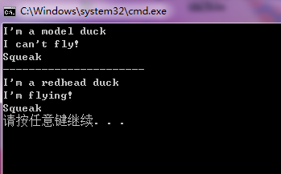

# 设计模式入门

## 1. 设计原则

- **找到应用中可能变化之处，把它们独立出来，不要和那些不需要变化的代码混在一起。**
把会变化的部分取出并封装起来，以便以后可以轻易地改动或扩充此部分，而不影响不需要变化的其他部分。
- **针对接口（Interface）编程，而不是针对实现（implenments）编程。**
- **多用组合，少用继承。**
如同书上所说，鸭子的行为不是(IS-A)继承extends而来的，而是通过各种（HAS-A）接口类FlyBehavior和QuackBehavior组合而来的。
这样做的好处有：
> - 使用组合具有更大的弹性，可以将算法簇封装成类
> - 只要组合的对象符合正确的接口标准，就可以在运行时动态地改变行为
---
## 2. 不清楚的部分（主要是不熟悉java）
- **abstract class、 interface、implememts的区别**
a. 抽象类可以有构造方法，**接口中不能有构造方法**。
b. 抽象类中可以有普通成员变量，**接口中没有普通成员变量**。
c. 抽象类中可以包含非抽象的普通方法，**接口中的所有方法必须都是抽象的**，不能有非抽象的普通方法。
d. 抽象类中的抽象方法的访问类型可以是public，protected和（默认类型,虽然
e. **interface只声明方法，并不去实现它**，而是**由其他类通过implement来实现之**，abstract定义为抽象类，有一部分方法可以实现，一部分不实现，而由他的子类来实现之。
---
## 3. 设计模式之策略模式的C++实现
由于C++不像**Java和C#**那样**把接口从实现中分离做得很好**（具有Interface和implements），所以在C++中要实现接口与实现分离，可以用以下两种方法（参考《Effective C++》条款31：将文件间的编译依存关系降至最低）：
- **Handle classes**：使用pimp idom(pointer to implementation)的classes
- **Interface classes**:接口类（例如FlyBehavior和QuackBehavior）为一个abstract base class(抽象基类,可使用pure vitual来达到此目的),在此类中一一描述derived class的接口。
---
## 4 用Interface classes来是实现策略模式

### 4.1创建FlyBehavior接口类与其实现类

**(抽象基类)接口类FlyBehavior.h代码：**

```C++
#pragma once
#ifndef  FLYBEHAVIOR_H
#define FLYBEHAVIOR_H

//这是一个抽象的飞行行为的接口类
class FlyBehavior {

public:
	FlyBehavior();
	~FlyBehavior();
	virtual void fly() const = 0;//pure-virtual+const成员函数，每个飞行行为都要继承并重写该函数
};

#endif // ! FLYBEHAVIOR_H
```

**FlyBehavior.cpp代码：**

```C++
#include "FlyBehavior.h"

FlyBehavior::FlyBehavior() {
}

FlyBehavior::~FlyBehavior() {
}

```

**具体实现类FlyNoWay.h代码：**

```C++
#pragma once
#ifndef FLYNOWAY_H
#define FLYNOWAY_H
#include "FlyBehavior.h"
//该类是从从接口类FlyBehavior继承而来的，用于实现不具有飞行行为的类
class FlyNoWay :
	public FlyBehavior {
public:
	FlyNoWay();
	~FlyNoWay();
	void fly() const override;//override说明覆盖接口类的virtual void fly();
};

#endif // !FLYNOWAY_H

```

**FlyNoWay.cpp代码:**

```C++
#include "FlyNoWay.h"
#include<iostream>
FlyNoWay::FlyNoWay() {
}

FlyNoWay::~FlyNoWay() {
}

void FlyNoWay::fly() const {
	std::cout << "I can't fly!" << std::endl;
}

```

**具体实现类FlyWithWings.h代码：**

```C++
#pragma once
#ifndef FLYWITHWINGS_H
#define FLYWITHWINGS_H
#include "FlyBehavior.h"
//该类是从从接口类FlyBehavior继承而来的，用于实现具有飞行行为的类
//class FlyBehavior;//由于要public继承FlyBehavior的接口，所以要用头文件，而不是前置声明
class FlyWithWings :
	public FlyBehavior {
public:
	FlyWithWings();
	~FlyWithWings();
	void fly() const override;//override说明覆盖接口类的virtual void fly();
};

#endif // !

```

**FlyWithWings.cpp代码：**

```C++
#include "FlyWithWings.h"
#include<iostream>


FlyWithWings::FlyWithWings() {
}


FlyWithWings::~FlyWithWings() {
}

void FlyWithWings::fly() const {
	std::cout << "I'm flying!" << std::endl;
}

```

### 4.2创建QuackBehavior接口类与其实现类

**(抽象基类)接口类QuackBehavior.h代码：**

```C++
#pragma once
#ifndef QUACKBEHAVIOR_H
#define QUACKBEHAVIOR_H
//这是一个抽象的叫的行为的接口类
class QuackBehavior {
public:
	QuackBehavior();
	~QuackBehavior();
	virtual void quack() const = 0;//pure-virtual+const成员函数，每个具有叫的行为都要继承并重写该函数
};


#endif // !QUACKBEHAVIOR_H

```

**具体实现类MuteQuack.h代码：**

```C++
#pragma once
#ifndef MUTEQUACK_H
#define MUTEQUACK_H
#include "QuackBehavior.h"
class MuteQuack :
	public QuackBehavior {
public:
	MuteQuack();
	~MuteQuack();
	void quack() const override;
};

#endif // !MUTEQUACK_H

```

**MuteQuack.cpp代码：**

```C++
#include "MuteQuack.h"
#include<iostream>


MuteQuack::MuteQuack() {
}


MuteQuack::~MuteQuack() {
}

void MuteQuack::quack() const {
	std::cout << "<< Silence >>" << std::endl;
}

```

**具体实现类Squeak.h代码：**

```C++
#pragma once
#ifndef SQUEAK_H
#define SQUEAK_H


#include "QuackBehavior.h"
class Squeak :
	public QuackBehavior {
public:
	Squeak();
	~Squeak();
	void quack() const override;
};


#endif // !SQUEAK_H
```

**Squeak.cpp代码：**

```C++
#include "Squeak.h"
#include <iostream>


Squeak::Squeak() {
}


Squeak::~Squeak() {
}

void Squeak::quack() const {
	std::cout << "Squeak" << std::endl;
}

```

### 4.3创建基类Duck类与其实现类

**基类Duck类Duck.h代码：**

```C++
#pragma once
#ifndef DUCK_H
#define DUCK_H
#include <memory>//要是用智能指针，加上这个头文件
//这是一个鸭子类的基类，具体的鸭子类（MallarDuck,RedheadDuck,RubberDuck,DecoyDuck继承该基类）
class FlyBehavior;//飞行行为类的前置声明，不用#include，实现接口与实现分离
class QuackBehavior;//叫的行为类的前置声明，不用#include，实现接口与实现分离
class Duck {
public:
	Duck() = default;//自动合成的默认构造函数
	//自定义的构造函数
	Duck(std::shared_ptr<FlyBehavior> pFB, std::shared_ptr<QuackBehavior> pQB) : pFlyBehavior(pFB), pQuackBehavior(pQB) {}
	virtual void display() const = 0;//pure-virtual + const的接口，具体的鸭子类要继承并复写这个函数
	~Duck();
	void performFly();//返回fly函数
	void performQuack();//返回quack函数
	void setFlyBehavior(const std::shared_ptr<FlyBehavior> rhs);
	void setQuackBehavior(const std::shared_ptr<QuackBehavior> rhs);
private:
	std::shared_ptr<FlyBehavior> pFlyBehavior;//使用智能指针，实现复合（HAS-A的关系），表示Duck类具有一个FlyBehavior行为类
	std::shared_ptr<QuackBehavior> pQuackBehavior;//使用智能指针，实现复合（HAS-A的关系），表示Duck类具有一个QuackBehavior行为类
};


#endif // !DUCK_H

```

**Duck.cpp代码：**

```C++
#include "Duck.h"
#include "FlyBehavior.h"
#include "QuackBehavior.h"

Duck::~Duck() {
}

void Duck::performFly() {
	pFlyBehavior->fly();
}

void Duck::performQuack() {
	pQuackBehavior->quack();
}

void Duck::setFlyBehavior(const std::shared_ptr<FlyBehavior> rhs) {
	pFlyBehavior = rhs;
}

void Duck::setQuackBehavior(const std::shared_ptr<QuackBehavior> rhs) {
	pQuackBehavior = rhs;
}

```

**派生类模型鸭子类ModelDuck.h代码：**

```C++
#pragma once
#ifndef MODELDUCK_H
#define MODELDUCK_H
//ModelDuck继承Duck类，是鸭子类的一个具体类
#include "Duck.h"
#include "FlyBehavior.h"
#include "QuackBehavior.h"
class ModelDuck :
	public Duck {
public:
	ModelDuck() = default;//此构造函数会调用Duck的构造函数
	~ModelDuck();
	void display() const override;//用于显示具体的鸭子类对象

};


#endif // !MODELDUCK_H

```

**ModelDuck.cpp代码：**

```C++
#include "ModelDuck.h"
#include <iostream>

ModelDuck::~ModelDuck() {
}

void ModelDuck::display() const {
	std::cout << "I'm a model duck" << std::endl;
}

```

**派生类红头鸭子类RedHeadDuck.h代码：**

```C++
#pragma once
#ifndef REDHEADDUCK_H
#define REDHEADDUCK_H

#include "Duck.h"

class RedHeadDuck :
	public Duck {
public:
	RedHeadDuck() = default;
	~RedHeadDuck();
	void display() const override;
};


#endif // !REDHEADDUCK_H
```

**RedHeadDuck.cpp代码：**

```C++
#include "RedHeadDuck.h"
#include <iostream>


RedHeadDuck::~RedHeadDuck() {
}

void RedHeadDuck::display() const {
	std::cout << "I'm a redhead duck" << std::endl;
}

```
---

### 4.4创建主函数来演示效果

**main.cpp代码：**

```C++
#include <iostream>

//#include "Duck.h"
#include "ModelDuck.h"
#include "RedHeadDuck.h"

//#include "FlyBehavior.h"
#include "FlyWithWings.h"
#include "FlyNoWay.h"

//#include "QuackBehavior.h"
#include "MuteQuack.h"
#include "Squeak.h"
int main() {
	ModelDuck model = ModelDuck();//使用合成的默认构造函数建立一个ModelDuck的类

	const std::shared_ptr<FlyBehavior> pFNW(new FlyNoWay);//模型鸭子不会飞
	model.setFlyBehavior(pFNW);

	const std::shared_ptr<Squeak> pS(new Squeak);//模型鸭子会叫
	model.setQuackBehavior(pS);

	model.display();//展示模型鸭子
	model.performFly();//展示模型鸭子的飞行行为
	model.performQuack();//展示模型鸭子的叫的行为

	std::cout << "----------------------" << std::endl;

	RedHeadDuck redHeadDuck = RedHeadDuck();//使用合成的默认构造函数建立一个RedHeadDuck的类

	const std::shared_ptr<FlyBehavior> pFWW(new FlyWithWings);//红头鸭子会飞
	redHeadDuck.setFlyBehavior(pFWW);

	const std::shared_ptr<Squeak> pS1(new Squeak);//红头鸭子会叫
	redHeadDuck.setQuackBehavior(pS1);

	redHeadDuck.display();//展示模型鸭子
	redHeadDuck.performFly();//展示模型鸭子的飞行行为
	redHeadDuck.performQuack();//展示模型鸭子的叫的行为
	
	system("pause");
	return 0;
}

```

**运行结果截图：**



---